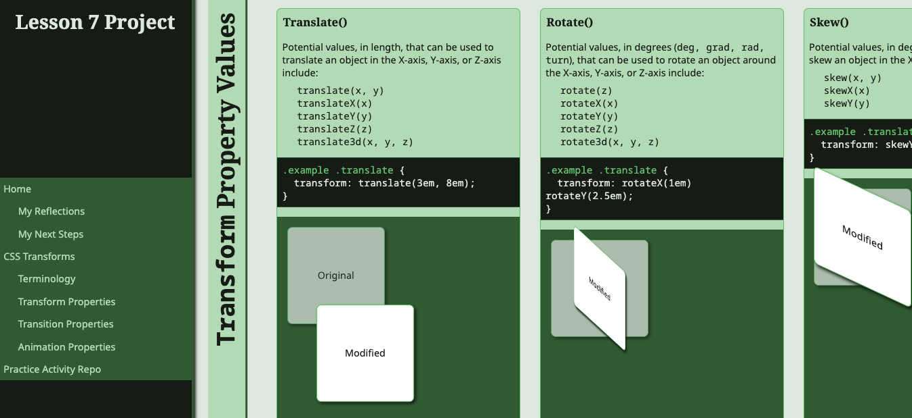

# Lesson 7 Project
This project will assess your knowledge and skills to create a site that scrolls horizontally rather than the standard vertical scrolling, and incorporate animations, transformations, and transitions to create effects for user interactions and different design layouts.

## Project Prep
1. If necessary, clone the repo to your computer within your course folder.
2. Open the repo within VS Code. You can open this `readme.md` file within VS Code to view the project directions there.
   > *TIP: Right click on the file and choose the `Open Preview` option.*
3. If there are files and folders present other than this `readme.md` file, take some time to familiarize yourself with the files within the repo so you know where they are located. This will help you when asked to use them within the project directions. *You can ignore the `.gitignore` file.*

> Read through all the project directions before you start working on the project so you know what you will be doing and can plan accordingly what elements to use, if classes and ids need to be created, etc.

## HTML Directions
You will create 2 HTML pages for this project, a reflection page and a cheatsheet page. If no element is specified, you must decide the most appropriate element to use. If a class/id is needed to help style an element, you may add one.

### Reflections Page
The reflection page will be the home page for the assignment where you will reflect on what you learned within the lesson, how you can use the concepts in future projects, and what you would like to learn more about. Complete the following steps:

1. Create an HTML document and call it `index.html`.
2. Add all the necessary base elements to structure the document.
3. Add the following metadata:
   1. Page title
   2. Author
   3. Description
   4. Keywords
   5. Character Set
   6. Document language
4. Using appropriate elements, create two sections:
   1. One section will contain:
   		1. A heading using the text `Lesson 7 Project`
   		2. Navigation with 3 links to the home page, cheatsheet page, and the home page of your practice activities for the lesson. *TIP: You can publish your practice activities using GitHub pages and use the URL to the index.html page to create the link.* 
   			1. Under the home page link, create 2 child links that will be for page navigation bookmark links. *TIP: Be sure to include the file name with the bookmark information so they work on any page (e.g., `<a href="index.html#bookmark-title">Link Title</a>`).*
			  The links will jump to the headings in the main element, which require `id` attributes applied to them and the links' `href` elements point to the appropriate `id` with a hashtag in front of it. e.g., `<a href="#heading2">Heading Title</a>`.
   			2. Under the cheatsheet page link, create four child links that will be for secondary page navigation bookmark links for that page.
   		3. Your name, GitHub username, and date.
   2. A main element.
5. Save and apply a commit to the file.
6. In the main element:
   1. Create two sections.
   2. Add a heading to each section with the text `My Reflections` and `My Next Steps`, respectively.
   3. Using appropriate elements, answer the following under the reflections heading:
      1. Reflect upon what you learned in this lesson and identify at least three things that were new to you and how you think you may use them in a project?
   4. Using appropriate elements, answer the following under the next steps heading:
      1. Reflecting on what you learned, what property or concept do you feel you need to learn more about or want to explore in more depth? Why do you feel that way? What steps do you feel could help you learn more about it?
7. Save and apply a commit to the file.

### Transformation Cheatsheet Page
The cheatsheet page will be a page about the concepts you learned in the lesson. It will provide the important concepts to remember so you can reference it later on to remind yourself of what you learned as you work on projects. Use the online reading and the Grid standard module. Complete the following steps:

1. Using the `index.html` file, save a new file with the name `transformation-cheatsheet.html`.
2. Update the metadata to reflect the content of the page.
3. Remove the content within the main element.
4. Within the main section:
	1. Create 4 sections.
	2. Add a heading to each section with the text `Terminology`, `Transform Properties`, `Transition Properties`, and `Animation Properties`.
	3. Add a definition list to the terminology section with the following terms and add, in your own words, the definitions for the terms.
		1. `Animations`
		2. `Keyframes`
		3. `Transforms`
		4. `Transitions`
		5. `Easing`
		6. `Rotation`
		7. `Scale`
		8. `Skew`
		9. `Delay`
		10. `Transition Timing`
	4. Save and apply a commit to the file.
	5. In the other sections:
   	1. Create a `div` element with a class of `example-code-card`:
      	1. A heading with the text `Example Code`. This should have the actual name of the property for the specific card, such as `Translate()` or `Rotate()`.
      	2. A paragraph that briefly explains the example code.
      	3. A code block that will display an example of the properties discussed in the section. The example should contain an example selector and declaration block.
      	4. A `div` element with a class to provide a preview of what the example code will look like when applied to an element.
   	2. Utilizing the example code card structure, create additional cards to demonstrate the transform, transition, and keyframe properties/components and their potential values.
      	1. There are 6 transform properties in total.
      	2. There are 4 transition properties in total.
      	3. There are 3 keyframe declaration block components for the at-rule and 9 properties.
	6. Save and apply commits to the file after each section.

## Styling Directions
You will utilize the concepts you learned in the lesson (and previous lessons) to layout and style the content on a page. You will need to determine the best layout method and property values to use to accomplish the task. You may utilize any type of selector needed to target the specific element. Complete the following:

1. Create a subfolder with the name `css`. 
2. Create a new file in the subfolder with the name `lsn7-styles.css` and open the file.
3. Add a comment at the top with your name, course and section, and instructor's name.
4. Create a color scheme to use for the project to style the background colors, text colors, border colors, and any other accent colors.
5. Define the fonts to use for the project with fallback fonts beyond the generic font families as variables. 
   1. You may import (e.g., from Google Fonts) or download and put the font files in a folder in the repo to achieve the desired effect.
   2. Define one for the headings, one for the body text, and one for the code blocks.
6. Create a browser reset declaration block to set the padding and margins to `0`, and the box sizing to be a border box for all elements.
7. Save and apply a commit to the file.

### Page Layout Styling
The page will be laid out in a 2 column design but will scroll horizontally rather than vertically.

1. For the page body:
   1. The whole page should be the 95 viewport height units tall. *This will help account for the scrollbar that will present to scroll horizontally vs. it being 100 units tall. Otherwise, content may appear behind the scrollbar.*
   2. The overflow in the `x` direction should scroll.
   3. Define the base font and color information using the variables you created.
   4. Convert the body element to a flex container with a row direction and no wrapping.
2. Apply the font and color information using the variables you created to all the headings. *TIP: Utilize multiple HTML selectors to select all headings.*
3. Save and apply a commit to the file.
4. For the header section:
   1. The section should be in the first column of the page on the left hand side.
   2. Make the column wide enough so that the text of the links appear in a single line.
   3. Make the child elements appear so they are stacked on top of each other.
   4. Make the background color different from the main section. Adjust the color of the text as needed to meet accessibility guidelines.
   5. Create styles for the parent navigation links, including animated link states.
   6. Create styles for the child navigation links similar to the parent links, but with a slightly darker or lighter background color to set them apart. Include animated link states.
   7. Create styles so that the link for the active page you are viewing is highlighted differently. i.e., if you are on the home page, the `Home` link would be styled differently from the other two links so users know they are on that page.
   8. Create styles so the child links only appear for the active page you are viewing. i.e., if you are on the cheatsheet page, you do not see the child links for the reflection page.
5. Save and apply a commit to the file.
6. Place the main element in the second column of the page.
   1. Layout the child sections in a row horizontally.
   2. For each child section:
		1. Apply a border to the left side.
		2. Rotate the heading 90 degrees counter-clockwise and position it along the left side of the section and the last letter is along the top.
		3. Increase the font size of the heading.
		4. Apply a text transform to the heading so it is in uppercase letters.
		5. Apply a different color to the heading.
		6. Content after the heading should appear to the right of the heading.
7. Save and apply a commit to the file.
8. Include a style that allows a user to disable animations and transitions for accessibility.
9.  Apply any additional styles you feel will help the page layout and design; save and apply a commit to the file.

### Cheatsheet Page Style
For the sections in the main element:

1. Style the code example element as follows:
   1. So it looks like a card with a drop shadow.
   2. The heading appears as a tab on top of the card.
   3. The code block has a different background color than the rest of the card and a border.
2. Style the properties and values as follows:
   1. Make each property (and at-rule component) into a card.
   2. Add the property so it appears as a tab at the top of the card.
   3. Display the values vertically so they appear on top of one another.
3. Position the cards in a grid to help fill in the available vertical space with the first card always being the code example card and adding new columns as needed. 
4. Leave an equal distance whitespace from the top and bottom of the viewport edge and the top and bottom edges of the cards.
5. See sample project image below (only the first few cards are shown, but this should provide an example of how the cards should be styled).

## Submit the Project
Before you submit your project:
1. Make sure that you have validated your HTML and CSS code. If any errors were found within the validators, be sure to fix those errors before you submit your assignment.
2. Be sure you have implemented accessibility best practices.
3. Save and apply any final commits to your work.
4. Push (i.e., sync) the repo on your computer with GitHub to ensure all files are uploaded for your instructor to see.
5. Verify that all files appear on GitHub.
6. Publish your project using GitHub Pages.
7. Open the Pull Requests tab within GitHub (or using the GitHub Extension within VS Code).
8. In the comment field,
   1. Type in your instructor's username with an @ before. See the course announcements for their username to use.
   2. Tell your instructor that your Project is ready for grading.
9. Click on the `Comment` button to finalize and submit your assignment.
